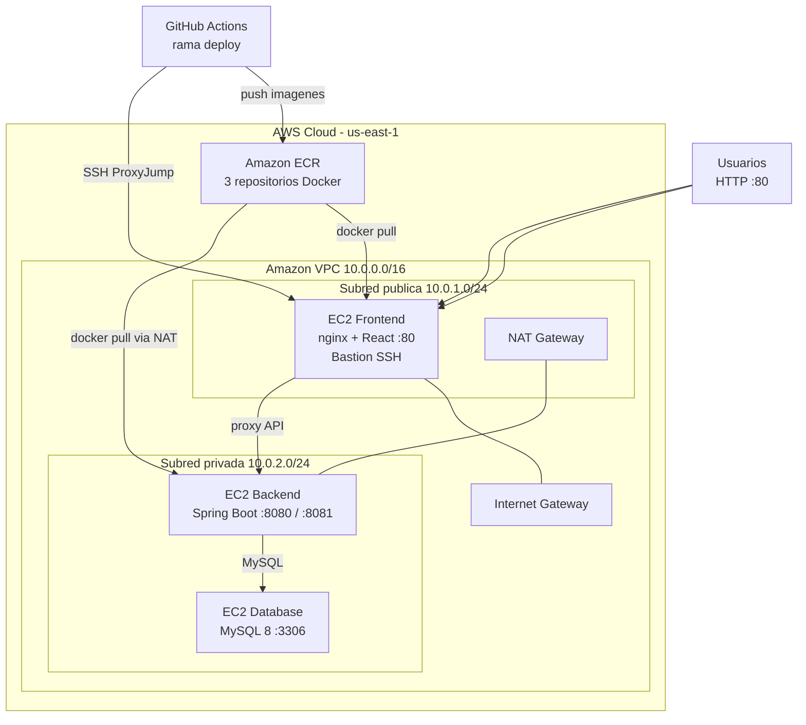
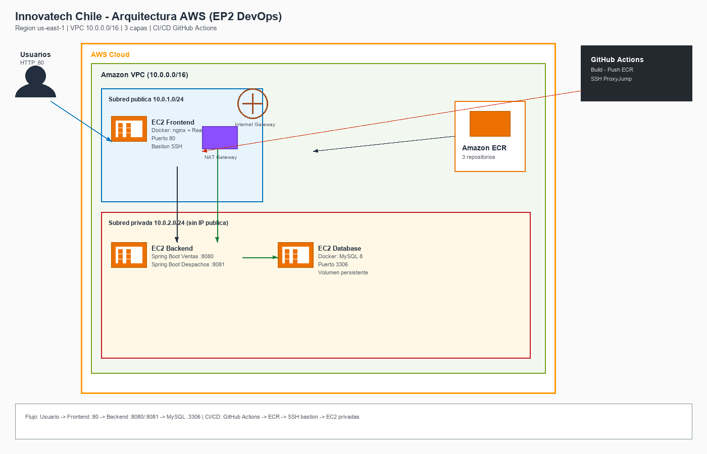

# Innovatech Chile — Infraestructura AWS con Terraform y CI/CD

**Descripción**  
Proyecto semestral DevOps (EP2) que despliega un sistema de gestión de **ventas** y **despachos** contenedorizado, con:

- **Docker** multi-stage y `docker-compose` para desarrollo local.
- **Amazon ECR** como registro de imágenes.
- **3 instancias EC2** en capas (frontend, backend, base de datos) dentro de una **VPC** con subred pública y privada.
- **NAT Gateway** para salida segura de instancias privadas hacia ECR.
- **GitHub Actions** para integración continua (CI) y despliegue continuo (CD).

Repositorio: [MonserratHL/Devops-EV2](https://github.com/MonserratHL/Devops-EV2)

---

## Diagrama de arquitectura





> **Editar el diagrama visual:** [`docs/arquitectura-aws.drawio`](docs/arquitectura-aws.drawio) en [diagrams.net](https://app.diagrams.net) (libreria AWS19). Exporta PNG y reemplaza `docs/arquitectura-aws.png`.

### Flujo de comunicación en producción

| Origen | Destino | Puerto | Protocolo |
|--------|---------|--------|-------------|
| Internet | EC2 Frontend | 80 | HTTP (único acceso público) |
| Frontend (nginx) | EC2 Backend | 8080 / 8081 | Proxy API REST |
| Backend (Spring Boot) | EC2 Database | 3306 | MySQL |
| EC2 privadas | Amazon ECR | 443 | Pull de imágenes (vía NAT) |
| GitHub Actions | EC2 Frontend | 22 | SSH (bastion) |
| GitHub Actions | EC2 Backend | 22 | SSH ProxyJump vía frontend |

---

## Estructura del proyecto

```
Devops-EV2/
├── README.md                          # Documentacion principal (esta pagina)
├── docs/
│   ├── arquitectura-aws.png           # Diagrama exportado (imagen)
│   └── arquitectura-aws.drawio        # Fuente editable draw.io
├── .github/workflows/
│   ├── ci.yml                         # Integracion continua
│   └── deploy.yml                     # Despliegue continuo
└── proyecto semestral/
    ├── docker-compose.yml
    ├── .env.example
    ├── infra/
    │   ├── etapa_1/                   # Terraform: ECR
    │   └── etapa_2/                   # Terraform: VPC + EC2
    ├── back-Ventas_SpringBoot/
    ├── back-Despachos_SpringBoot/
    └── front_despacho/
```

---

## Requisitos

| Herramienta | Versión mínima |
|-------------|----------------|
| [Docker](https://www.docker.com/) | 24+ |
| [Docker Compose](https://docs.docker.com/compose/) | v2 |
| [Terraform CLI](https://www.terraform.io/downloads) | >= 1.0 |
| [AWS CLI](https://aws.amazon.com/cli/) | v2 (opcional) |
| Cuenta **AWS** | AWS Academy Learner Lab o cuenta con permisos EC2/VPC/ECR |
| [GitHub](https://github.com/) | Repositorio con Actions habilitado |

**Provider Terraform:** `hashicorp/aws` ~> 5.0  
**Región por defecto:** `us-east-1`

---

## Inicio rápido

### 1. Ejecución local (Docker Compose)

```bash
cd "proyecto semestral"
cp .env.example .env
docker compose up -d --build
```

Acceso: **http://localhost**

Los datos de ventas se cargan automáticamente si la base está vacía. Pulsa **Consultar** en las tarjetas para ver las APIs en acción.

### 2. Infraestructura AWS (Terraform)

**Etapa 1 — Repositorios ECR**

```bash
cd "proyecto semestral/infra/etapa_1"
terraform init
terraform apply
```

**Etapa 2 — VPC, subredes, NAT, 3 EC2 y Security Groups**

> Ejecuta siempre **etapa_1** antes que **etapa_2**. La etapa 2 reutiliza los repositorios ECR mediante *data sources*.

```bash
cd "../etapa_2"
cp terraform.tfvars.example terraform.tfvars
# Edita key_pair_name y db_password
terraform init
terraform plan
terraform apply
```

**Outputs útiles:**

```bash
terraform output frontend_public_ip
terraform output backend_private_ip
terraform output database_private_ip
```

### 3. Despliegue con GitHub Actions

Configura los [secrets](#secrets-de-github) y haz push a la rama **`deploy`**:

```bash
git checkout deploy
git merge main
git push origin deploy
```

La aplicación quedará disponible en: `http://<frontend_public_ip>`

---

## Qué despliega cada etapa

### Etapa 1 — `infra/etapa_1`

| Recurso | Nombre |
|---------|--------|
| `aws_ecr_repository` | `innovatech-backend-ventas` |
| `aws_ecr_repository` | `innovatech-backend-despachos` |
| `aws_ecr_repository` | `innovatech-frontend` |

Escaneo de vulnerabilidades en push habilitado.

### Etapa 2 — `infra/etapa_2`

| Categoría | Recursos |
|-----------|----------|
| **Red** | VPC `10.0.0.0/16`, subred pública `10.0.1.0/24`, subred privada `10.0.2.0/24` |
| **Conectividad** | Internet Gateway, NAT Gateway, tablas de ruteo |
| **Cómputo** | 3 × `aws_instance` (Amazon Linux 2023, Docker en user_data) |
| **Seguridad** | 3 Security Groups con reglas mínimas entre capas |
| **Datos** | MySQL 8 en contenedor Docker con volumen persistente |

| Instancia | Rol | Subred | IP pública |
|-----------|-----|--------|------------|
| `innovatech-frontend` | nginx + React | Pública | Sí (:80) |
| `innovatech-backend` | Spring Boot ×2 | Privada | No |
| `innovatech-database` | MySQL 8 | Privada | No |

---

## Estrategia de ramas Git

| Rama | Propósito | Pipeline |
|------|-----------|----------|
| `feature/*` / `fix/*` | Desarrollo de funcionalidades | CI al hacer push |
| `develop` | Integración | CI |
| `main` | Código estable | CI |
| `deploy` | Publicación en AWS | **CD** (build → ECR → EC2) |

**Flujo recomendado:**

```
feature/* → develop → main → deploy
```

---

## Pipelines CI/CD

### Integración continua — `ci.yml`

Se ejecuta en **push** a `main`, `develop`, `feature/*`, `fix/*` y en **pull requests** hacia `main` / `develop`.

1. Copia `.env.example` → `.env`
2. `docker compose build`
3. `docker compose up -d`
4. Reintentos con `curl` a `/api/v1/ventas` y `/api/v1/despachos`
5. `docker compose down -v`

**No despliega en AWS.** Solo valida que el stack Docker funciona.

### Despliegue continuo — `deploy.yml`

Se ejecuta **solo** en push a la rama **`deploy`**.

1. Build multi-plataforma `linux/amd64` de las 3 imágenes
2. Push a **Amazon ECR** (tag `latest` + SHA del commit)
3. SSH al frontend con `webfactory/ssh-agent`
4. **ProxyJump** al backend privado → `docker pull` + `docker run`
5. Despliegue del frontend con variable `BACKEND_HOST`
6. Verificación de APIs

---

## Secrets de GitHub

`Settings` → `Secrets and variables` → `Actions`

| Secret | Descripción |
|--------|-------------|
| `AWS_ACCESS_KEY_ID` | Credencial AWS |
| `AWS_SECRET_ACCESS_KEY` | Credencial AWS |
| `AWS_SESSION_TOKEN` | Token de sesión (requerido en AWS Academy) |
| `EC2_FRONTEND_HOST` | IP **pública** del frontend (`terraform output frontend_public_ip`) |
| `EC2_BACKEND_PRIVATE_IP` | IP privada del backend |
| `EC2_DB_PRIVATE_IP` | IP privada de la instancia database |
| `EC2_SSH_PRIVATE_KEY` | Contenido completo del archivo `.pem` (key pair usado en Terraform) |
| `DB_NAME` | Nombre de la base (ej. `innovatech_db`) |
| `DB_PASSWORD` | Misma contraseña que `db_password` en `terraform apply` |

Tras un **reset del Learner Lab**, actualiza las IPs con `terraform output` y vuelve a pegar el `.pem` si el key pair cambió.

---

## Arquitectura de contenedores (local y EC2)

| Servicio | Imagen | Puerto | Usuario |
|----------|--------|--------|---------|
| Frontend | `innovatech-frontend` | 80 → 8080 (nginx) | no root (UID 101) |
| Backend ventas | `innovatech-backend-ventas` | 8080 | no root |
| Backend despachos | `innovatech-backend-despachos` | 8081 | no root |
| MySQL | `mysql:8` | 3306 | — |

**Red Docker local:** `innovatech-net` (bridge)  
**Volumen:** `innovatech-mysql-data`

---

## Requisitos EP2 cubiertos

- [x] Dockerfiles **multi-stage** con usuario no root  
- [x] `docker-compose.yml` con redes, volúmenes y healthchecks  
- [x] Publicación de imágenes en **Amazon ECR**  
- [x] Pipeline **CI/CD** en GitHub Actions  
- [x] Infraestructura **Terraform** (ECR + VPC + EC2)  
- [x] Solo el **frontend** accesible desde Internet  
- [x] **3 capas** en subredes (presentación, lógica, datos)  

---

## Mejores prácticas incluidas

- **Separación de responsabilidades:** Terraform en dos etapas (ECR vs. cómputo/red).
- **Principio de mínimo privilegio:** Security Groups por capa; backend y BD sin IP pública.
- **Bastion SSH:** el frontend permite despliegue CI/CD hacia instancias privadas.
- **Variables y outputs:** configuración centralizada en `variables.tf` / `outputs.tf`.
- **Imágenes inmutables:** tags en ECR por commit SHA y `latest`.
- **Healthchecks** en MySQL para orden de arranque en Compose.
- **Trazabilidad DevOps:** historial de fallos y correcciones documentado en Actions.

---

## Cómo extender el proyecto

- Añadir **Application Load Balancer** delante del frontend con HTTPS (ACM).
- Migrar MySQL a **Amazon RDS** en subred privada.
- Usar **AWS Secrets Manager** para credenciales en lugar de secrets planos.
- Implementar **Terraform remote state** (S3 + DynamoDB lock).
- Añadir `workflow_dispatch` para despliegues manuales desde GitHub.
- Configurar **CloudWatch** logs y alarmas por instancia.
- Escalar backends con **ECS Fargate** manteniendo la misma VPC.

---

## Solución de problemas

| Síntoma | Causa probable | Acción |
|---------|----------------|--------|
| Página carga pero tablas vacías | APIs con 502 | Revisar logs en EC2 backend; verificar secrets `EC2_DB_PRIVATE_IP` y `DB_PASSWORD` |
| `Permission denied (publickey)` en deploy | PEM o IP incorrectos | Actualizar secrets tras `terraform apply` |
| CI falla con `Public Key Retrieval` | MySQL 8 + driver JDBC | Corregido con `allowPublicKeyRetrieval=true` en `application.properties` |
| Diagrama no se ve en GitHub | SVG con caracteres invalidos | Usar diagrama Mermaid + PNG en README (sin archivos .svg) |
| `terraform destroy` lento | NAT Gateway + EC2 | Normal en Learner Lab; esperar varios minutos |

### Conectar a MySQL en la instancia database

```bash
ssh -i mi-key-duoc.pem -J ec2-user@<IP_PUBLICA_FRONTEND> ec2-user@<IP_PRIVADA_DATABASE>
sudo docker exec -it mysql mysql -u root -p innovatech_db
```

### Verificar APIs desde tu máquina

```bash
curl http://<IP_PUBLICA_FRONTEND>/api/v1/ventas
curl http://<IP_PUBLICA_FRONTEND>/api/v1/despachos
```

---

## Historial del pipeline (trazabilidad)

| Problema | Solución aplicada |
|----------|-------------------|
| Repositorios ECR duplicados | Data sources en etapa 2 |
| Variables ECR no llegaban al EC2 | Password ECR desde Actions + `envs` |
| `permission denied` en Docker | `sudo docker` en scripts de deploy |
| SSH `unable to authenticate` | `ssh-agent` + ProxyJump; secrets actualizados |
| CI 502 / timeout | Reintentos + `allowPublicKeyRetrieval` para MySQL 8 |

Runs: [GitHub Actions](https://github.com/MonserratHL/Devops-EV2/actions)

---

## Equipo y contexto académico

- **Asignatura:** DevOps — Evaluación Parcial 2 (EP2)  
- **Institución:** Duoc UC  
- **Proyecto:** Innovatech Chile — ventas y despachos  

---

## Referencias

- [AWS Architecture Icons](https://aws.amazon.com/architecture/icons/)
- [Terraform AWS Provider](https://registry.terraform.io/providers/hashicorp/aws/latest/docs)
- [GitHub Actions](https://docs.github.com/en/actions)
- Ejemplo de estructura README IaC: [deployment_azure_netwrok_terraform](https://github.com/jorgee-lab/deployment_azure_netwrok_terraform)
