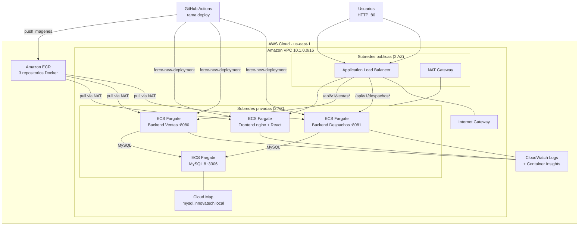

# Innovatech Chile — Orquestación ECS Fargate con Terraform y CI/CD

**Descripción**  
Proyecto semestral DevOps (EP3) que despliega un sistema de gestión de **ventas** y **despachos** contenedorizado con:

- **Docker** multi-stage y `docker-compose` para desarrollo local.
- **Amazon ECR** como registro de imágenes.
- **Amazon ECS Fargate** como orquestador de contenedores (sin servidores EC2 de aplicación).
- **Application Load Balancer** con enrutamiento por path (`/api/v1/ventas*`, `/api/v1/despachos*`, frontend).
- **Autoscaling** Target Tracking (CPU y memoria al 50 %).
- **CloudWatch Logs** y Container Insights para observabilidad.
- **GitHub Actions** para integración continua (CI) y despliegue continuo (CD) build → push → deploy.

Repositorio: [MonserratHL/Devops-EV2](https://github.com/MonserratHL/Devops-EV2)

---

## Diagrama de arquitectura (EP3 — ECS Fargate)



### Flujo de comunicación en producción (ECS)

| Origen | Destino | Puerto | Protocolo |
|--------|---------|--------|-------------|
| Internet | ALB | 80 | HTTP (único acceso público) |
| ALB | ECS Frontend | 8080 | HTTP (ruta `/`) |
| ALB | ECS Backend Ventas | 8080 | HTTP (ruta `/api/v1/ventas*`) |
| ALB | ECS Backend Despachos | 8081 | HTTP (ruta `/api/v1/despachos*`) |
| Backends Spring Boot | ECS MySQL | 3306 | MySQL vía Cloud Map DNS |
| Tareas ECS privadas | Amazon ECR | 443 | Pull de imágenes (vía NAT) |

---

## Estructura del proyecto

```
Devops-EV2/
├── README.md                          # Documentacion principal (esta pagina)
├── docs/
│   ├── arquitectura-aws.png           # Diagrama EP2 (referencia historica)
│   ├── arquitectura-aws.drawio
│   └── scripts/
│       └── load-test-alb.sh           # Simulacion de carga para autoscaling
├── .github/workflows/
│   ├── ci.yml                         # Integracion continua
│   └── deploy.yml                     # Despliegue continuo ECS
└── proyecto semestral/
    ├── docker-compose.yml
    ├── .env.example
    ├── infra/
    │   ├── etapa_1/                   # Terraform: ECR
    │   ├── etapa_2/                   # Terraform: VPC + EC2 (EP2, legacy)
    │   └── etapa_3/                   # Terraform: ECS Fargate + ALB (EP3)
    ├── back-Ventas_SpringBoot/
    ├── back-Despachos_SpringBoot/
    └── front_despacho/
```

---

## Requisitos

| Herramienta | Versión mínima |
|-------------|----------------|
| [Docker](https://www.docker.com/) | 24+ |
| [Docker Compose](https://docs.docker.com/compose/) | v2 |
| [Terraform CLI](https://www.terraform.io/downloads) | >= 1.0 |
| [AWS CLI](https://aws.amazon.com/cli/) | v2 |
| Cuenta **AWS** | AWS Academy Learner Lab o cuenta con permisos ECS/VPC/ECR/ALB |
| [GitHub](https://github.com/) | Repositorio con Actions habilitado |

**Provider Terraform:** `hashicorp/aws` ~> 5.0  
**Región por defecto:** `us-east-1`

---

## Inicio rápido

### 1. Ejecución local (Docker Compose)

```bash
cd "proyecto semestral"
cp .env.example .env
docker compose up -d --build
```

Acceso: **http://localhost**

### 2. Infraestructura AWS (Terraform)

**Etapa 1 — Repositorios ECR**

```bash
cd "proyecto semestral/infra/etapa_1"
terraform init
terraform apply
```

**Etapa 3 — ECS Fargate, ALB, autoscaling y CloudWatch**

> Ejecuta **etapa_1** antes que **etapa_3**. La etapa 3 reutiliza ECR mediante *data sources*.  
> Si tienes recursos de **etapa_2** (EC2) activos, destrúyelos primero para evitar costos duplicados.

```bash
cd "../etapa_3"
cp terraform.tfvars.example terraform.tfvars
# Edita db_password
terraform init
terraform plan
terraform apply
```

**Outputs útiles:**

```bash
terraform output application_url
terraform output ecs_cluster_name
terraform output cloudwatch_log_groups
```

### 3. Despliegue con GitHub Actions

1. Configura los [secrets](#secrets-de-github).
2. Haz push inicial de imágenes (primer deploy) o merge a **`deploy`**:

```bash
git checkout deploy
git merge main
git push origin deploy
```

La aplicación quedará disponible en: `http://<alb_dns_name>` (ver `terraform output application_url`)

---

## Qué despliega cada etapa

### Etapa 1 — `infra/etapa_1`

| Recurso | Nombre |
|---------|--------|
| `aws_ecr_repository` | `innovatech-backend-ventas` |
| `aws_ecr_repository` | `innovatech-backend-despachos` |
| `aws_ecr_repository` | `innovatech-frontend` |

### Etapa 3 — `infra/etapa_3` (EP3)

| Categoría | Recursos |
|-----------|----------|
| **Red** | VPC `10.1.0.0/16`, 2 subredes públicas + 2 privadas (multi-AZ) |
| **Conectividad** | Internet Gateway, NAT Gateway, tablas de ruteo |
| **Orquestación** | ECS Cluster Fargate + Capacity Providers |
| **Balanceo** | Application Load Balancer con reglas por path |
| **Servicios ECS** | frontend, backend-ventas, backend-despachos, mysql |
| **IAM** | Execution Role + Task Role |
| **Observabilidad** | CloudWatch Log Groups, Container Insights |
| **Autoscaling** | Target Tracking CPU/Memory al 50 % (min 1, max 3 tareas) |
| **DNS interno** | Cloud Map (`mysql.innovatech.local`) |

| Servicio ECS | Imagen | Puerto | Subred |
|--------------|--------|--------|--------|
| `innovatech-frontend` | ECR frontend | 8080 | Privada (vía ALB) |
| `innovatech-backend-ventas` | ECR backend-ventas | 8080 | Privada (vía ALB) |
| `innovatech-backend-despachos` | ECR backend-despachos | 8081 | Privada (vía ALB) |
| `innovatech-mysql` | mysql:8 | 3306 | Privada (Cloud Map) |

---

## Estrategia de ramas Git

| Rama | Propósito | Pipeline |
|------|-----------|----------|
| `feature/*` / `fix/*` | Desarrollo de funcionalidades | CI al hacer push |
| `develop` | Integración | CI |
| `main` | Código estable | CI |
| `deploy` | Publicación en AWS ECS | **CD** (build → ECR → ECS) |

**Flujo recomendado:**

```
feature/ep3-* → develop → main → deploy
```

---

## Pipelines CI/CD

### Integración continua — `ci.yml`

Se ejecuta en **push** a `main`, `develop`, `feature/*`, `fix/*` y en **pull requests** hacia `main` / `develop`.

1. Copia `.env.example` → `.env`
2. `docker compose build`
3. `docker compose up -d`
4. Reintentos con `curl` a `/api/v1/ventas` y `/api/v1/despachos`
5. `docker compose down -v`

**No despliega en AWS.** Solo valida que el stack Docker funciona.

### Despliegue continuo — `deploy.yml` (EP3)

Se ejecuta **solo** en push a la rama **`deploy`**.

1. Build multi-plataforma `linux/amd64` de las 3 imágenes
2. Push a **Amazon ECR** (tag `latest` + SHA del commit)
3. `aws ecs update-service --force-new-deployment` en frontend y backends
4. Espera estabilidad con `aws ecs wait services-stable`
5. Verificación HTTP vía ALB (`/`, `/api/v1/ventas`, `/api/v1/despachos`)
6. Resumen de tiempos del pipeline en logs

---

## Secrets de GitHub

`Settings` → `Secrets and variables` → `Actions`

| Secret | Descripción |
|--------|-------------|
| `AWS_ACCESS_KEY_ID` | Credencial AWS |
| `AWS_SECRET_ACCESS_KEY` | Credencial AWS |
| `AWS_SESSION_TOKEN` | Token de sesión (requerido en AWS Academy) |
| `ECS_ALB_DNS_NAME` | DNS del ALB (`terraform output alb_dns_name`) |

> **Nota:** Los secrets de EC2 (`EC2_SSH_PRIVATE_KEY`, `EC2_FRONTEND_HOST`, etc.) ya no son necesarios para EP3. Se conservan solo si mantienes la infraestructura legacy de etapa_2.

Tras un **reset del Learner Lab**, vuelve a ejecutar `terraform apply` en etapa_3 y actualiza `ECS_ALB_DNS_NAME`.

---

## Autoscaling y simulación de carga

El autoscaling usa **Target Tracking** con umbral de **50 % CPU y 50 % memoria** (configurable en `terraform.tfvars` → `autoscaling_target_cpu`).

Para evidenciar escalado durante la presentación:

```bash
chmod +x docs/scripts/load-test-alb.sh
./docs/scripts/load-test-alb.sh <dns-del-alb> 120
```

Monitorea en AWS Console:
- **ECS** → Cluster → Services → pestaña *Auto Scaling*
- **CloudWatch** → Container Insights → métricas CPU/Memory
- **CloudWatch Logs** → `/ecs/innovatech/*`

---

## Logs y métricas (EP3)

| Grupo CloudWatch | Servicio |
|------------------|----------|
| `/ecs/innovatech/frontend` | nginx + React |
| `/ecs/innovatech/backend-ventas` | API Spring Boot ventas |
| `/ecs/innovatech/backend-despachos` | API Spring Boot despachos |
| `/ecs/innovatech/mysql` | MySQL 8 |

Consultar logs desde CLI:

```bash
aws logs tail /ecs/innovatech/backend-ventas --follow
```

Métricas del pipeline: revisar el step *Resumen de metricas del pipeline* en [GitHub Actions](https://github.com/MonserratHL/Devops-EV2/actions).

---

## Requisitos EP3 cubiertos

- [x] Clúster **ECS Fargate** con Capacity Providers  
- [x] VPC, subredes multi-AZ y Security Groups  
- [x] Roles IAM (execution role + task role)  
- [x] Despliegue Frontend + Backend desde **Amazon ECR**  
- [x] Variables de entorno en Task Definitions  
- [x] **Application Load Balancer** con acceso público al frontend  
- [x] Comunicación Front → Back vía ALB (mismo origen HTTP)  
- [x] **Autoscaling** Target Tracking CPU/Memory  
- [x] **CloudWatch Logs** por servicio  
- [x] Pipeline CI/CD **build → push → deploy** automatizado  
- [x] Secrets gestionados en GitHub (sin credenciales en código)  
- [x] Script de simulación de carga para evidencia de autoscaling  

---

## Arquitectura de contenedores (local)

| Servicio | Imagen | Puerto | Usuario |
|----------|--------|--------|---------|
| Frontend | `innovatech-frontend` | 80 → 8080 (nginx) | no root (UID 101) |
| Backend ventas | `innovatech-backend-ventas` | 8080 | no root |
| Backend despachos | `innovatech-backend-despachos` | 8081 | no root |
| MySQL | `mysql:8` | 3306 | — |

---

## Solución de problemas

| Síntoma | Causa probable | Acción |
|---------|----------------|--------|
| Servicios ECS en `PENDING` | Sin imágenes en ECR | Ejecuta deploy o push manual a ECR |
| Target group `unhealthy` | Backend aún iniciando | Espera 2–3 min; revisa logs CloudWatch |
| 502 en ALB | MySQL no responde | Verifica servicio `innovatech-mysql` y Cloud Map |
| Deploy falla en verificación ALB | Secret `ECS_ALB_DNS_NAME` incorrecto | Actualiza con `terraform output alb_dns_name` |
| Autoscaling no escala | Carga insuficiente | Usa `load-test-alb.sh` por 2+ minutos |

### Verificar APIs desde tu máquina

```bash
ALB=$(cd "proyecto semestral/infra/etapa_3" && terraform output -raw alb_dns_name)
curl "http://${ALB}/api/v1/ventas"
curl "http://${ALB}/api/v1/despachos"
```

---

## Equipo y contexto académico

- **Asignatura:** DevOps — Evaluación Parcial 3 (EP3)  
- **Institución:** Duoc UC  
- **Proyecto:** Innovatech Chile — orquestación ECS y CI/CD  

---

## Referencias

- [Amazon ECS on Fargate](https://docs.aws.amazon.com/AmazonECS/latest/developerguide/AWS_Fargate.html)
- [Application Load Balancer](https://docs.aws.amazon.com/elasticloadbalancing/latest/application/)
- [Terraform AWS Provider](https://registry.terraform.io/providers/hashicorp/aws/latest/docs)
- [GitHub Actions](https://docs.github.com/en/actions)
